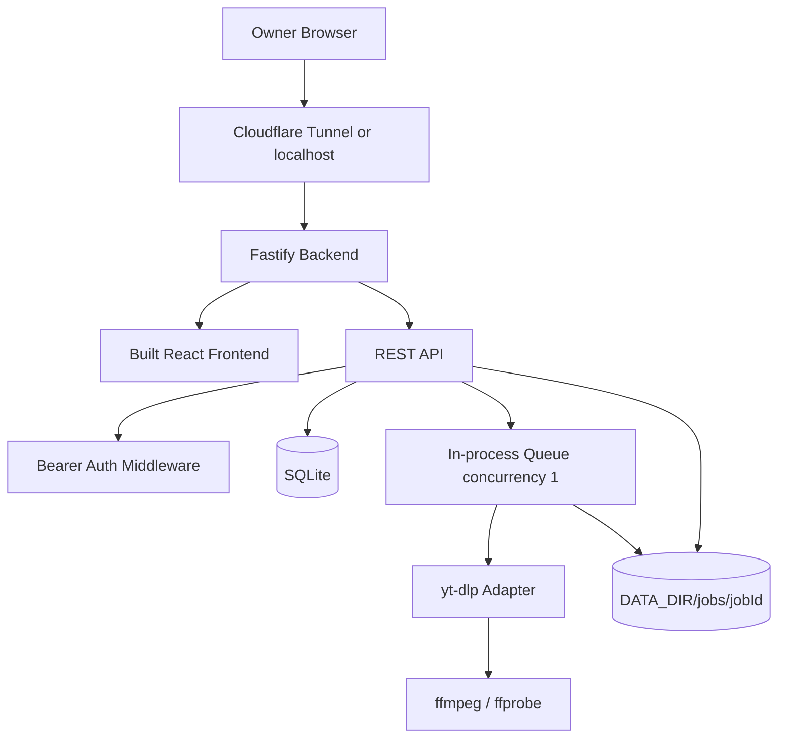

# P0 MVP Design Spec: Local Video Link Downloader

**Source PRD:** `yt-dlp-web-downloader-prd.md` v0.1, dated 2026-06-26

**Scope:** P0/MVP only. P1/P2 items are explicit non-goals unless required to avoid blocking P0 behavior.

## Goal

Build a single-owner web app that accepts one video URL, analyzes it with `yt-dlp`, creates an asynchronous download job, tracks progress, and exposes a time-limited signed download link from the local machine through a protected backend.

## Assumptions

- The first supported deployment target is the owner's local machine behind Cloudflare Tunnel.
- The app uses app-level bearer token auth for MVP, with Cloudflare Access documented as the recommended outer layer.
- Frontend and backend are served from the same origin in production to keep CORS closed by default.
- SQLite is used for durable job and download token state because P0 requires persistence across backend restart (`NFR-004`).
- MVP uses polling instead of SSE (`FR-051`); SSE is deferred (`FR-052`).
- The implementation will use mock `yt-dlp` executables or adapter mocks in tests; automated tests must not download external media.

## Non-Goals

- No anonymous public use (`SEC-001`).
- No DRM, paywall, login, region, or access-control bypass (`SEC-009`).
- No playlist, channel, or batch URL downloads.
- No browser cookie import or externally uploaded cookies.
- No multi-user accounts, billing, quotas, or cloud object storage.
- No manual quality picker, job history page, cancel UI, delete UI, SSE, range requests, Docker Compose, or Cloudflare Access step-by-step guide in P0.

## Architecture

### Backend Design

- Fastify serves `/health`, protected `/api/*`, protected static production assets, and signed download URLs.
- `/health` is public and returns only `{ ok, time }` (`FR-082`).
- All `/api/*` routes require `Authorization: Bearer <ADMIN_TOKEN>` unless protected by Cloudflare Access plus app token (`SEC-001`, `SEC-002`).
- `POST /api/analyze` validates URL safety, runs `yt-dlp --dump-json` through an adapter, normalizes metadata, and returns an `analysisId` (`FR-010` through `FR-014`).
- `POST /api/jobs` creates a queued job and returns immediately (`FR-030`, `FR-031`, `NFR-002`).
- A single in-process queue transitions jobs through `queued`, `running`, `completed`, `failed`, `canceled`, and `expired` (`FR-032`, `FR-033`).
- `GET /api/jobs/{jobId}` returns normalized status, progress, result, and error data for polling (`FR-050`, `FR-051`, `FR-053`).
- `GET /api/download/{token}` validates a hashed signed token, streams the file, and never accepts a filesystem path from the client (`FR-060` through `FR-064`, `NFR-005`, `NFR-006`).
- `GET /api/system/check` reports dependency versions, data directory writability, and disk space (`FR-080`).
- A cleanup service expires jobs and removes only allowed job directories under `DATA_DIR/jobs` (`FR-070`, `FR-071`, `NFR-008`).

### Frontend Design

- React + Vite + TypeScript.
- Home route `/` shows system status, token entry if needed, URL input, ownership warning copy, analysis result, and default download action.
- Job route `/jobs/{jobId}` shows status, progress, failure message, and completed download link.
- Polling interval is 1-3 seconds while jobs are queued or running; polling stops on terminal states (`FR-051`).
- Token is stored in `sessionStorage`, not `localStorage`, for app-level auth (`SEC-001`, `SEC-002`).
- User-facing errors are Chinese, normalized, and do not expose stack traces, shell commands, secret tokens, or sensitive paths (`FR-014`, `SEC-008`).

## Data Model

### `jobs`

- `id`: `job_` prefixed ULID or UUID.
- `url`: original requested URL.
- `normalizedUrl`: backend-normalized or yt-dlp webpage URL.
- `title`: nullable video title.
- `extractor`: nullable yt-dlp extractor.
- `status`: `queued`, `running`, `completed`, `failed`, `canceled`, or `expired`.
- `optionsJson`: selected options, defaulting to `bestUnder1080p` and `preferMp4: true`.
- `progressJson`: latest normalized progress.
- `resultJson`: nullable output file metadata and download URL data.
- `errorJson`: nullable normalized error.
- `createdAt`, `updatedAt`, `startedAt`, `completedAt`, `expiresAt`.

### `download_tokens`

- `tokenHash`: hash of the generated token; plaintext token is never stored.
- `jobId`: completed job ID.
- `expiresAt`, `createdAt`, `usedAt`.

### `analyses`

- `id`: `ana_` prefixed ULID or UUID.
- `url`: original requested URL.
- `metadataJson`: normalized analysis metadata.
- `createdAt`, `expiresAt`; default analysis TTL is 1 hour.

## API Contract

### Public

- `GET /health`
  - Success: `{ "ok": true, "time": "<ISO timestamp>" }`
  - Must not expose config, paths, dependency versions, or auth state.

### Protected

- `GET /api/system/check`
  - Returns `dependencies.ytDlp`, `dependencies.ffmpeg`, `dependencies.ffprobe`, `storage.writable`, `storage.freeBytes`, and `storage.minRequiredFreeBytes`.

- `POST /api/analyze`
  - Request: `{ "url": "https://example.com/watch?v=abc123" }`
  - Success includes `analysisId`, `url`, `title`, `thumbnail`, `durationSeconds`, `extractor`, `webpageUrl`, `recommendedOptions`, and `formatSummary`.
  - Errors use `{ "error": { "code": "...", "message": "...", "retryable": false } }`.

- `POST /api/jobs`
  - Request: `{ "analysisId": "ana_...", "url": "https://...", "options": { "qualityPreset": "bestUnder1080p", "preferMp4": true } }`
  - Success: `{ "jobId": "job_...", "status": "queued", "statusUrl": "/api/jobs/job_..." }`

- `GET /api/jobs/{jobId}`
  - Returns job status, timestamps, title, progress, result, and error.

- `GET /api/download/{token}`
  - Streams the completed file with `Content-Disposition`, `Content-Type`, `Content-Length`, and `Cache-Control: private, no-store`.
  - Invalid, expired, or expired-job tokens return 404 or 410 without exposing file paths.

## Security Requirements

- `FR-002`, `FR-003`, `SEC-003`: backend accepts only `http:` and `https:` URLs and blocks localhost, private IP ranges, link-local, metadata IPs, and private IPv6. DNS-resolved private targets are rejected.
- `SEC-004`, `FR-042`: all `yt-dlp` and dependency invocations use argument arrays via `spawn` or `execa`; no shell string interpolation.
- `SEC-005`, `FR-043`: user input never determines job directory or download file path.
- `SEC-006`, `FR-060`: download tokens have at least 128 bits of entropy, are stored hashed, and expire after 24 hours by default.
- `SEC-007`: analyze and job creation endpoints are rate-limited per IP or token.
- `SEC-010`: CORS is closed in same-origin production; if separated during development, allowed origins are explicit env config.

## yt-dlp Strategy

- Analyze args: `["--dump-json", "--no-playlist", "--no-warnings", "--", url]`.
- Download args include `--no-playlist`, `--newline`, `--progress-template`, `-S "res:1080"`, `--merge-output-format mp4`, controlled `--paths`, controlled `-o`, `--`, and URL.
- Default quality is best under 1080p (`FR-021`).
- Output prefers mp4 but accepts actual completed file extension and MIME type when mp4 remux is not possible (`FR-022`).
- Progress parser consumes JSON progress lines and falls back to indeterminate progress when fields are unavailable (`FR-044`).

## Testing Requirements

- Unit tests:
  - URL safety validator (`FR-002`, `FR-003`, `SEC-003`).
  - command builder (`FR-012`, `FR-021`, `FR-042`, `FR-043`, `SEC-004`).
  - job state machine (`FR-032`).
  - token service (`FR-060`, `FR-064`, `SEC-006`).
  - storage guard and cleanup (`FR-070`, `FR-071`, `NFR-008`).
  - error normalizer (`FR-014`, `SEC-008`).
- Integration tests:
  - mock `yt-dlp` analyze output.
  - mock `yt-dlp` progress and fake output file.
  - protected analyze-to-download flow.
  - missing dependency system check.
  - unauthorized API rejection.
- E2E or browser tests:
  - token entry, URL validation, analyze result, job polling, completed download action, and readable failures.

## Acceptance Criteria

- All P0 requirement IDs from the PRD are mapped to implementation tasks.
- `/api/system/check` reports dependency and storage readiness.
- A safe supported URL can be analyzed and downloaded through an asynchronous job.
- Job creation returns immediately and progress is visible through polling.
- Completed files stream through signed download URLs and expire after TTL.
- Unauthorized API requests fail.
- SSRF, command injection, path traversal, expired token, disk threshold, and cleanup boundaries are tested.
- README and `.env.example` explain local setup, auth, dependency install, Cloudflare Tunnel, data retention, and legal limits.
