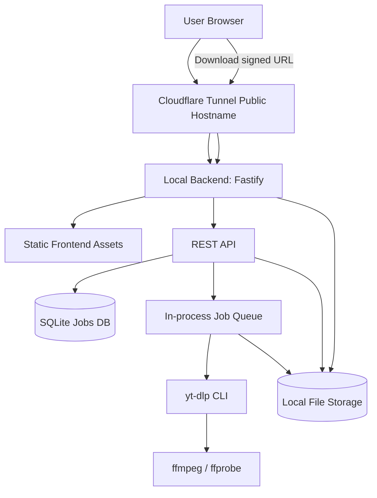
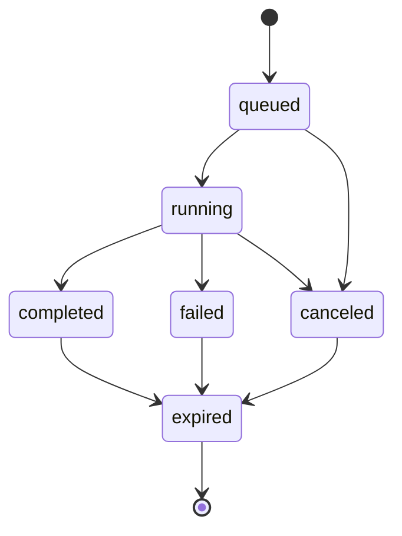

# PRD：yt-dlp 前端影片下載器

**版本**：v0.1  
**日期**：2026-06-26  
**文件目的**：作為 Superpowers / coding agent 產生 `spec.md`、`plan.md`、`tasks.md` 與測試計畫的產品需求來源。  
**產品代號**：Local Video Link Downloader  
**主要使用者**：單一系統擁有者 / 管理者本人  
**部署模式**：後端跑在本機電腦，透過 Cloudflare Tunnel 暴露到外網。

---

## 0. 給 Superpowers / Coding Agent 的執行指令

本 PRD 應被視為「需求來源」，不是最終技術設計。請依序產出：

1. `spec.md`：鎖定 MVP，保留本文件中的 requirement ID，例如 `FR-001`、`NFR-002`。
2. `plan.md`：拆成可逐步完成的工程任務，每個任務需標明對應 requirement ID、需修改的檔案、測試方式與驗收方式。
3. `tasks.md`：每個 task 應可在單一 context 中完成；優先使用 TDD，尤其是 URL 驗證、job state machine、yt-dlp command builder、download token、檔案清理。
4. 實作時不可直接跳過安全需求。`SEC-*` 為 MVP 必做，除非本文件明確標記為 P1/P2。
5. 對 yt-dlp 的測試必須優先使用 mock executable 或 adapter mock，避免測試環境實際下載外部內容。
6. 不要在 MVP 引入多使用者、付款、瀏覽器 cookies 匯入、playlist 批次下載、雲端物件儲存；除非進入 P1/P2。

---

## 1. 背景與問題

使用者希望有一個簡單的前端網頁：輸入影片連結後，前端將 URL 送到後端；後端使用 `yt-dlp` 分析該連結、下載必要影音片段、透過 `ffmpeg` 合併成完整影片，最後提供可下載的檔案連結給前端。

後端預計部署在使用者自己的電腦上，並透過 Cloudflare Tunnel 提供外網存取。由於 yt-dlp 任務可能耗時、檔案可能很大、Cloudflare proxy/tunnel 不適合長時間同步等待，因此產品需採用「非同步任務」架構。

---

## 2. 目標

### 2.1 MVP 目標

1. 使用者可在網頁輸入一個影片 URL。
2. 系統可呼叫後端使用 yt-dlp 分析 URL，取得標題、縮圖、時長、來源、可用格式與建議下載格式。
3. 使用者可確認下載設定後建立下載任務。
4. 後端可排程下載任務，執行 yt-dlp，並在需要時使用 ffmpeg 合併影音。
5. 前端可顯示任務狀態、進度、速度、估計剩餘時間、錯誤訊息。
6. 任務完成後，前端顯示一個有期限的下載連結。
7. 系統能自動清理過期檔案，避免本機磁碟被占滿。
8. 系統預設為單一擁有者使用，必須有存取保護，避免成為公開濫用的下載服務。

### 2.2 非目標

1. 不做 DRM、付費牆或任何形式的存取控制繞過。
2. 不提供公開匿名任意使用的下載服務。
3. 不保證所有網站皆可下載；支援範圍以 yt-dlp 本身支援能力為準。
4. MVP 不支援 playlist / channel 批次下載。
5. MVP 不支援上傳 cookies 或自動讀取本機瀏覽器 cookies。
6. MVP 不做使用者帳號系統；只做單一管理者 access token 或 Cloudflare Access。
7. MVP 不做雲端儲存；影片檔案儲存在本機電腦。
8. MVP 不做影片轉碼編輯器，只做下載、合併、可選的 remux。

---

## 3. 使用情境

### 3.1 主要情境：單一影片下載

1. 使用者開啟網頁。
2. 輸入影片 URL。
3. 按下「分析」。
4. 系統顯示影片資訊：標題、縮圖、時長、來源、建議格式。
5. 使用者選擇品質或使用預設品質。
6. 按下「開始下載」。
7. 系統建立任務，前端顯示進度。
8. 下載完成後，前端顯示「下載檔案」按鈕。
9. 使用者點擊下載連結取得完整影片。
10. 檔案在保留期限後自動刪除。

### 3.2 失敗情境：不支援或無法下載

1. 使用者輸入 URL。
2. 系統分析失敗，顯示可理解錯誤，例如：不支援網站、影片不存在、需要登入、地區限制、網路錯誤、yt-dlp 錯誤。
3. 系統不可顯示完整 stack trace、shell command token 或敏感路徑。
4. 管理者可在後端 log 查到完整錯誤細節。

### 3.3 長時間任務情境

1. 使用者建立大型影片下載任務。
2. 前端即時或近即時顯示任務仍在執行。
3. 若使用者重新整理頁面，可透過 job id 回到任務狀態頁。
4. 任務完成後仍可在 TTL 內取得下載連結。

---

## 4. 使用者角色與權限

| 角色 | 描述 | 權限 |
|---|---|---|
| Owner/Admin | 系統擁有者本人 | 分析 URL、建立任務、查看任務、取消任務、下載檔案、刪除任務、查看系統健康狀態 |
| Anonymous Internet User | 未授權外部訪客 | 無權使用 API；只能看到登入/拒絕頁或 Cloudflare Access 驗證 |

MVP 預設只允許 Owner/Admin 使用。即使服務透過 Cloudflare Tunnel 暴露到外網，也不得預設開放匿名下載。

---

## 5. 產品範圍與優先級

### P0 / MVP 必做

- 單一 URL 輸入與格式驗證。
- yt-dlp 分析。
- 建立單一影片下載任務。
- 任務 queue，預設 concurrency = 1。
- 下載進度追蹤。
- 下載完成後提供簽章下載連結。
- 本機檔案儲存與 TTL 清理。
- 基本 access token 或 Cloudflare Access 整合說明。
- SSRF / command injection / path traversal 防護。
- 系統 health check：yt-dlp、ffmpeg、ffprobe、磁碟空間、可寫目錄。

### P1 / 下一版

- 多品質選項 UI。
- SSE 即時進度；MVP 可先用 polling。
- 任務歷史頁。
- 下載取消。
- 手動刪除已完成檔案。
- 下載完成通知，例如 browser notification。
- Docker Compose 部署。
- Cloudflare Access 官方設定指南。

### P2 / 未來版

- Playlist 下載。
- 批次 URL。
- 字幕下載與內嵌。
- 音訊抽取。
- 上傳到 R2 / S3 / NAS。
- 多使用者與配額。
- 可設定 cookies，但僅限本機管理者、不可讓外部訪客上傳任意 cookies。

---

## 6. 建議技術棧

### 6.1 前端

- Framework：React + Vite + TypeScript。
- UI：原生 CSS modules 或 Tailwind CSS；MVP 不需大型元件庫。
- 狀態：React Query 或簡單 `useState` + polling。
- 表單驗證：Zod 或自訂 URL validator。

### 6.2 後端

- Runtime：Node.js 22 LTS + TypeScript。
- HTTP server：Fastify。
- Process execution：`child_process.spawn` 或 `execa`，必須使用 argument array，不可使用 shell string。
- Queue：in-process queue，預設 concurrency = 1；可使用 `p-queue` 或自訂 queue。
- DB：SQLite，建議 `better-sqlite3` 或 Prisma SQLite。MVP 也可先用 JSON metadata files，但 SQLite 較利於 job history 與 crash recovery。
- File storage：本機資料夾，例如 `./data/jobs/{jobId}`。
- yt-dlp：優先呼叫 CLI，透過 adapter 封裝，方便測試 mock。
- ffmpeg / ffprobe：系統 binary，啟動時檢查。

### 6.3 部署

- 本機啟動 backend：`localhost:8787`。
- 前端可由 backend serve static files，或另跑 Vite preview；MVP 建議由 backend serve build 後的 frontend，避免 CORS 複雜度。
- Cloudflare Tunnel 將 public hostname 指到 `http://localhost:8787`。

---

## 7. 系統架構



### 7.1 架構原則

1. 分析與下載分離：分析 URL 不應直接開始下載。
2. 任務非同步：下載任務不可綁定單一 HTTP request 等待完成。
3. 檔案本機化：下載完成後由 backend 以 streaming 方式提供檔案。
4. API 與檔案下載都需授權或簽章。
5. 所有 yt-dlp 呼叫都必須經過 adapter，集中處理參數、log、progress parsing、錯誤分類。

---

## 8. 功能需求

### 8.1 URL 輸入與驗證

| ID | Requirement | Priority | Acceptance Criteria |
|---|---|---|---|
| FR-001 | 前端提供 URL input 與「分析」按鈕。 | P0 | 使用者貼上 URL 後可提交；空值顯示錯誤；非 URL 顯示錯誤。 |
| FR-002 | 後端只接受 `http:` 與 `https:` URL。 | P0 | `file:`, `ftp:`, `data:`, `javascript:` 等 protocol 被拒絕。 |
| FR-003 | 後端需阻擋 localhost、private IP、link-local、metadata IP 與內網位址，避免 SSRF。 | P0 | `127.0.0.1`, `localhost`, `10.0.0.0/8`, `172.16.0.0/12`, `192.168.0.0/16`, `169.254.0.0/16`, IPv6 loopback/private 被拒絕。 |
| FR-004 | 前端需顯示「請只下載你有權下載的內容」提示。 | P0 | URL form 附近有明確提示文案。 |

### 8.2 影片分析

| ID | Requirement | Priority | Acceptance Criteria |
|---|---|---|---|
| FR-010 | 後端提供 `POST /api/analyze`。 | P0 | 傳入 URL 後呼叫 yt-dlp 取得 metadata。 |
| FR-011 | 分析結果需包含 `analysisId`、title、thumbnail、duration、extractor、webpageUrl、formats summary。 | P0 | 前端可用 response render metadata card。 |
| FR-012 | 分析時不得下載影片內容。 | P0 | 使用 yt-dlp simulation / dump metadata 模式；測試需驗證 command 不含下載輸出路徑。 |
| FR-013 | 後端需設定分析 timeout。 | P0 | 預設 60 秒；逾時回傳 `ANALYZE_TIMEOUT`。 |
| FR-014 | 分析失敗需回傳 normalized error。 | P0 | 前端不顯示 raw stack trace；API response 有 `code`, `message`, `retryable`。 |

### 8.3 下載設定

| ID | Requirement | Priority | Acceptance Criteria |
|---|---|---|---|
| FR-020 | 前端允許使用預設品質開始下載。 | P0 | 使用者不選格式也能建立任務。 |
| FR-021 | 預設下載策略為「1080p 以下最佳品質；若無 1080p 以下，選擇最接近可用品質」。 | P0 | Command builder 產生可測試的 format/sort args。 |
| FR-022 | MVP 預設輸出容器優先為 mp4；若無法 mp4，允許回傳實際產物副檔名。 | P0 | 完成後 `file.ext` 與 `contentType` 正確。 |
| FR-023 | P1 支援手動選擇品質，例如 best、1080p、720p、audio-only。 | P1 | UI 顯示選項並傳入 backend。 |

### 8.4 任務建立與排程

| ID | Requirement | Priority | Acceptance Criteria |
|---|---|---|---|
| FR-030 | 後端提供 `POST /api/jobs` 建立下載任務。 | P0 | 傳入 `analysisId` 或 `url` + options 後建立 job。 |
| FR-031 | 任務建立後立即回傳 `jobId`，不可等待下載完成。 | P0 | API response time 不依賴影片大小。 |
| FR-032 | 系統需維護 job state machine。 | P0 | 狀態至少包含 `queued`, `running`, `completed`, `failed`, `canceled`, `expired`。 |
| FR-033 | MVP 同時只執行一個下載任務。 | P0 | 多任務建立時依序排隊。 |
| FR-034 | 任務需可 crash recovery。 | P1 | backend 重啟後可讀取 DB，將未完成任務標記為 `failed` 或重新排程。 |

### 8.5 yt-dlp 下載與合併

| ID | Requirement | Priority | Acceptance Criteria |
|---|---|---|---|
| FR-040 | 後端需透過 yt-dlp 下載影片。 | P0 | Job running 時啟動 yt-dlp process；完成後產生檔案。 |
| FR-041 | 後端需支援 video/audio 分離格式合併。 | P0 | 環境有 ffmpeg 時，可處理需要合併的格式。 |
| FR-042 | 所有 yt-dlp command 必須使用 argument array，不可 shell interpolation。 | P0 | 測試覆蓋 command builder；lint 或 code review 禁止 `exec("yt-dlp ...")`。 |
| FR-043 | yt-dlp output path 必須由系統生成，不可直接使用使用者輸入。 | P0 | 檔案寫入 `data/jobs/{jobId}`；不可 path traversal。 |
| FR-044 | 後端需解析 yt-dlp 進度。 | P0 | 前端可看到 percent、downloadedBytes、speed、eta；若無資料則顯示 indeterminate progress。 |
| FR-045 | 後端需保存最後 N 行 log 供 debug。 | P1 | Admin job detail 可查看 sanitized log。 |

### 8.6 進度顯示

| ID | Requirement | Priority | Acceptance Criteria |
|---|---|---|---|
| FR-050 | 前端任務頁需顯示目前狀態。 | P0 | queued/running/completed/failed/canceled 顯示不同文案。 |
| FR-051 | 前端需定期 polling `GET /api/jobs/{jobId}`。 | P0 | MVP 每 1–3 秒 polling；完成或失敗後停止。 |
| FR-052 | P1 支援 SSE `GET /api/jobs/{jobId}/events`。 | P1 | Running job progress 低延遲更新。 |
| FR-053 | 使用者重新整理頁面後仍能透過 job id 查看任務。 | P0 | URL route 包含 job id，例如 `/jobs/{jobId}`。 |

### 8.7 下載連結

| ID | Requirement | Priority | Acceptance Criteria |
|---|---|---|---|
| FR-060 | 任務完成後產生 signed download token。 | P0 | token 不可猜測，預設 24 小時過期。 |
| FR-061 | 後端提供 `GET /api/download/{token}`。 | P0 | token 有效時以 streaming response 回傳檔案。 |
| FR-062 | 下載 response 需設定正確 headers。 | P0 | `Content-Disposition`, `Content-Type`, `Content-Length`, `Cache-Control: private, no-store`。 |
| FR-063 | 支援 HTTP Range requests。 | P1 | 大檔案下載中斷可續傳；回傳 206 Partial Content。 |
| FR-064 | token 過期或 job expired 後不可下載。 | P0 | 回傳 404 或 410，不暴露實際檔案路徑。 |

### 8.8 檔案保留與清理

| ID | Requirement | Priority | Acceptance Criteria |
|---|---|---|---|
| FR-070 | 下載檔案需有 TTL。 | P0 | 預設 24 小時；可用 env 設定。 |
| FR-071 | 系統需定期清理過期檔案與 temp 檔。 | P0 | 排程每小時執行；清理後 job 標記為 expired。 |
| FR-072 | 系統需檢查磁碟空間。 | P0 | 可用空間低於門檻時拒絕新任務，回傳 `INSUFFICIENT_DISK_SPACE`。 |
| FR-073 | 單一任務可設定最大檔案大小或最大執行時間。 | P1 | 超過限制自動 cancel / fail。 |

### 8.9 系統健康檢查

| ID | Requirement | Priority | Acceptance Criteria |
|---|---|---|---|
| FR-080 | 後端提供 `GET /api/system/check`。 | P0 | 回傳 yt-dlp、ffmpeg、ffprobe 是否可用，版本資訊，資料目錄可寫性，磁碟空間。 |
| FR-081 | 前端顯示系統不可用原因。 | P0 | 若缺 ffmpeg 或 yt-dlp，首頁顯示設定提示。 |
| FR-082 | `GET /health` 用於 tunnel / uptime check。 | P0 | 回傳簡單 `{ ok: true }`，不可暴露敏感資訊。 |

---

## 9. API 規格草案

### 9.1 Auth

MVP 可採二選一：

1. **Cloudflare Access**：推薦，外部請求先由 Cloudflare Access 驗證。
2. **App-level token**：使用 `Authorization: Bearer <ADMIN_TOKEN>`；前端第一次載入要求輸入 token，保存在 session storage，不寫入 local storage。

若同時啟用 Cloudflare Access 與 app-level token，兩者都需通過。

### 9.2 `GET /health`

Response:

```json
{
  "ok": true,
  "time": "2026-06-26T00:00:00.000Z"
}
```

### 9.3 `GET /api/system/check`

Response:

```json
{
  "ok": true,
  "dependencies": {
    "ytDlp": { "ok": true, "version": "2026.xx.xx" },
    "ffmpeg": { "ok": true, "version": "7.x" },
    "ffprobe": { "ok": true, "version": "7.x" }
  },
  "storage": {
    "dataDir": "/app/data",
    "writable": true,
    "freeBytes": 123456789000,
    "minRequiredFreeBytes": 5368709120
  }
}
```

### 9.4 `POST /api/analyze`

Request:

```json
{
  "url": "https://example.com/watch?v=abc123"
}
```

Response:

```json
{
  "analysisId": "ana_01HY...",
  "url": "https://example.com/watch?v=abc123",
  "title": "Example Video",
  "thumbnail": "https://...",
  "durationSeconds": 1234,
  "extractor": "youtube",
  "webpageUrl": "https://...",
  "recommendedOptions": {
    "qualityPreset": "bestUnder1080p",
    "preferMp4": true
  },
  "formatSummary": [
    {
      "label": "Best <= 1080p",
      "qualityPreset": "bestUnder1080p",
      "estimatedSizeBytes": null
    },
    {
      "label": "Best available",
      "qualityPreset": "best"
    },
    {
      "label": "720p",
      "qualityPreset": "720p"
    }
  ]
}
```

Error response:

```json
{
  "error": {
    "code": "UNSUPPORTED_URL",
    "message": "這個連結目前無法由 yt-dlp 分析。",
    "retryable": false
  }
}
```

### 9.5 `POST /api/jobs`

Request:

```json
{
  "analysisId": "ana_01HY...",
  "url": "https://example.com/watch?v=abc123",
  "options": {
    "qualityPreset": "bestUnder1080p",
    "preferMp4": true
  }
}
```

Response:

```json
{
  "jobId": "job_01HY...",
  "status": "queued",
  "statusUrl": "/api/jobs/job_01HY..."
}
```

### 9.6 `GET /api/jobs/{jobId}`

Response:

```json
{
  "jobId": "job_01HY...",
  "status": "running",
  "createdAt": "2026-06-26T00:00:00.000Z",
  "updatedAt": "2026-06-26T00:01:00.000Z",
  "title": "Example Video",
  "progress": {
    "percent": 42.5,
    "downloadedBytes": 123456789,
    "totalBytes": 290000000,
    "speedBytesPerSecond": 3000000,
    "etaSeconds": 55,
    "phase": "downloading"
  },
  "result": null,
  "error": null
}
```

Completed response:

```json
{
  "jobId": "job_01HY...",
  "status": "completed",
  "title": "Example Video",
  "progress": {
    "percent": 100,
    "phase": "completed"
  },
  "result": {
    "filename": "Example Video.mp4",
    "sizeBytes": 345678901,
    "contentType": "video/mp4",
    "downloadUrl": "/api/download/dl_01HY...",
    "expiresAt": "2026-06-27T00:00:00.000Z"
  },
  "error": null
}
```

### 9.7 `POST /api/jobs/{jobId}/cancel`

Response:

```json
{
  "jobId": "job_01HY...",
  "status": "canceled"
}
```

### 9.8 `DELETE /api/jobs/{jobId}`

Response:

```json
{
  "ok": true
}
```

---

## 10. Job State Machine



### 10.1 狀態定義

| State | 定義 |
|---|---|
| `queued` | 任務已建立，等待 queue 執行。 |
| `running` | yt-dlp process 正在執行，或處於合併 / remux 階段。 |
| `completed` | 已產生可下載檔案與 signed token。 |
| `failed` | 任務失敗，保留 normalized error。 |
| `canceled` | 使用者或系統取消任務。 |
| `expired` | 任務檔案已過期清理，不可再下載。 |

### 10.2 Progress phase

| Phase | 說明 |
|---|---|
| `starting` | 準備 command、建立工作目錄。 |
| `downloading` | yt-dlp 正在下載影音片段。 |
| `merging` | ffmpeg 正在合併影音。 |
| `postprocessing` | remux、metadata、檔名處理。 |
| `completed` | 完成。 |
| `failed` | 失敗。 |

---

## 11. yt-dlp / ffmpeg 執行策略

### 11.1 依賴檢查

啟動時需檢查：

```bash
yt-dlp --version
ffmpeg -version
ffprobe -version
```

若 yt-dlp 不存在，系統不可允許建立分析或下載任務。若 ffmpeg / ffprobe 不存在，系統可分析，但不可開始需要合併的下載任務；UI 應顯示清楚提示。

### 11.2 分析 command 草案

```bash
yt-dlp \
  --dump-json \
  --no-playlist \
  --no-warnings \
  -- \
  <URL>
```

注意：

- 實作需使用 argument array：`["--dump-json", "--no-playlist", "--no-warnings", "--", url]`。
- 不可組字串後丟給 shell。
- 分析結果需做 schema normalization，避免前端直接依賴 yt-dlp 原始 JSON 的所有細節。

### 11.3 下載 command 草案

預設策略：1080p 以下最佳品質，並盡量合併為 mp4。

```bash
yt-dlp \
  --no-playlist \
  --newline \
  --progress-template "download:%(progress)j" \
  -S "res:1080" \
  --merge-output-format mp4 \
  --paths "home:<JOB_DIR>" \
  --paths "temp:<JOB_DIR>/tmp" \
  -o "%(id)s.%(ext)s" \
  -- \
  <URL>
```

實作注意：

1. `<JOB_DIR>` 必須是系統生成，例如 `data/jobs/{jobId}`。
2. 輸出檔名可先用 yt-dlp video id，前端下載時再用 sanitized title 設定 `Content-Disposition`。
3. `--newline` 與 progress template 用於解析進度。
4. `-S "res:1080"` 表示選擇不高於 1080p 的最佳解析度；若沒有符合者，依 yt-dlp 排序選擇最接近格式。
5. 若使用者選擇 `best`，可不加 `-S "res:1080"`。
6. 若下載完成後產物不是 mp4，系統需接受實際副檔名並正確回傳 MIME type；不要因 mp4 remux 失敗就刪除可用產物，除非產物不可播放。

### 11.4 錯誤分類

| yt-dlp / system error | API code | retryable |
|---|---|---|
| URL invalid / unsupported | `UNSUPPORTED_URL` | false |
| Need login / private video | `AUTH_REQUIRED` | false |
| Geo restriction | `GEO_RESTRICTED` | false |
| Network timeout | `NETWORK_TIMEOUT` | true |
| yt-dlp process timeout | `DOWNLOAD_TIMEOUT` | true |
| ffmpeg missing | `FFMPEG_MISSING` | false |
| Disk full | `INSUFFICIENT_DISK_SPACE` | true after cleanup |
| Unknown process exit | `YTDLP_FAILED` | maybe |

---

## 12. 前端需求

### 12.1 頁面

| Route | 描述 | Priority |
|---|---|---|
| `/` | URL 輸入、系統健康提示、最近任務簡表。 | P0 |
| `/analyze/{analysisId}` | 分析結果與下載設定。也可 MVP 合併在首頁。 | P1 |
| `/jobs/{jobId}` | 任務狀態、進度、錯誤、下載按鈕。 | P0 |
| `/settings` | 顯示 API endpoint、auth 狀態、system check。 | P1 |

### 12.2 UI 元件

- `UrlSubmitForm`
- `SystemStatusBanner`
- `VideoMetadataCard`
- `QualityPresetSelector`
- `JobProgressCard`
- `DownloadResultCard`
- `ErrorAlert`
- `RecentJobsList`

### 12.3 必要 UX 文案

- URL input 下方：`請只下載你擁有權利或已取得授權的內容；本工具不支援 DRM 或付費牆繞過。`
- 建立任務後：`下載任務已建立。大型影片可能需要較長時間，請勿關閉本機後端。`
- 完成後：`下載連結將於 {expiresAt} 過期。`
- 系統缺 ffmpeg：`偵測不到 ffmpeg。部分影片需要 ffmpeg 合併音訊與影像，請先安裝 ffmpeg。`

---

## 13. 安全需求

| ID | Requirement | Priority | Acceptance Criteria |
|---|---|---|---|
| SEC-001 | 系統預設不可匿名公開使用。 | P0 | 未授權請求 API 回傳 401/403。 |
| SEC-002 | 所有 API endpoint 除 `/health` 與前端 static assets 外，都需授權。 | P0 | 測試覆蓋未帶 token 的 API 請求。 |
| SEC-003 | 後端只接受 http/https URL，並阻擋 private network。 | P0 | URL validator unit tests 覆蓋 private IPv4/IPv6/hostname。 |
| SEC-004 | yt-dlp command 使用 spawn/execa argument array，不經 shell。 | P0 | 測試 command builder；code review 禁止 shell string。 |
| SEC-005 | 檔案路徑不可由使用者輸入決定。 | P0 | 所有 job dir 使用 server-generated id；下載 API 不接受 path 參數。 |
| SEC-006 | Download token 必須不可猜測且有期限。 | P0 | token 至少 128-bit entropy；過期後不可下載。 |
| SEC-007 | Rate limiting。 | P0 | 預設每 IP / token 每分鐘最多 N 次 analyze/job 建立；可用 env 設定。 |
| SEC-008 | 不回傳 raw stack trace 或完整系統路徑到前端。 | P0 | Error response normalized；raw logs 僅在 server log。 |
| SEC-009 | 不支援 DRM 或付費牆繞過。 | P0 | UI 與 docs 明示；不加入相關參數或功能。 |
| SEC-010 | CORS 預設同源。 | P0 | 若前後端同 origin，CORS 關閉；若分離，僅允許設定的 origin。 |

---

## 14. 非功能需求

| ID | Requirement | Target |
|---|---|---|
| NFR-001 | 本機單人使用情境下，系統需穩定處理 1 個 running job + 多個 queued jobs。 | Concurrency default = 1。 |
| NFR-002 | `POST /api/jobs` 不等待下載完成。 | 正常情況 < 1 秒回傳。 |
| NFR-003 | `POST /api/analyze` 有 timeout。 | 預設 60 秒。 |
| NFR-004 | 任務資料可在 backend 重啟後保留。 | SQLite 或 metadata files。 |
| NFR-005 | 檔案下載採 streaming。 | 不把整個影片讀入記憶體。 |
| NFR-006 | 大檔案下載不應被 backend cache 到 memory。 | 使用 stream pipeline。 |
| NFR-007 | 系統需可在 Windows/macOS/Linux 至少一種平台正常跑；優先支援使用者本機 OS。 | 以 Node.js cross-platform path 實作。 |
| NFR-008 | 清理任務不可刪除 data directory 外的檔案。 | 僅操作 job dir allowlist。 |
| NFR-009 | 所有 server config 由 env 或 config file 控制。 | 不把 token、路徑、domain 寫死在程式碼。 |

---

## 15. 設定項目

建議 `.env`：

```env
NODE_ENV=production
PORT=8787
PUBLIC_BASE_URL=https://video.example.com
ADMIN_TOKEN=replace-with-long-random-token
DATA_DIR=./data
JOB_CONCURRENCY=1
ANALYZE_TIMEOUT_SECONDS=60
DOWNLOAD_TIMEOUT_SECONDS=7200
FILE_TTL_HOURS=24
CLEANUP_INTERVAL_MINUTES=60
MIN_FREE_DISK_BYTES=5368709120
RATE_LIMIT_ANALYZE_PER_MINUTE=10
RATE_LIMIT_JOB_CREATE_PER_MINUTE=5
ENABLE_SSE=false
ENABLE_RANGE_REQUESTS=false
```

---

## 16. Cloudflare Tunnel 部署需求

### 16.1 部署前提

- 使用者已有 Cloudflare account。
- 使用者已有可由 Cloudflare 管理 DNS 的 domain。
- 本機 backend 正在 `http://localhost:8787` 服務。
- 本機安裝 `cloudflared`。

### 16.2 建議設定

Cloudflare Tunnel route：

```text
Public hostname: video.example.com
Service URL: http://localhost:8787
```

### 16.3 安全建議

1. 優先使用 Cloudflare Access 限制只有自己能開啟網頁。
2. App-level token 仍保留作為第二層防護。
3. 不要把此工具開放給匿名外部使用者。
4. 若下載大檔，後端需以 streaming response 提供檔案，並避免同步長時間 request。
5. 不要把 yt-dlp 任務設計成「前端送出後 HTTP request 一直等到完成」；必須使用 job queue。

---

## 17. 資料模型

### 17.1 `jobs`

| Field | Type | Description |
|---|---|---|
| `id` | string | `job_` prefix ULID/UUID。 |
| `url` | string | 原始 URL。 |
| `normalizedUrl` | string | yt-dlp 回傳或後端 normalization 後 URL。 |
| `title` | string nullable | 影片標題。 |
| `extractor` | string nullable | yt-dlp extractor。 |
| `status` | string | queued/running/completed/failed/canceled/expired。 |
| `optionsJson` | text | 下載選項。 |
| `progressJson` | text | 最新進度。 |
| `resultJson` | text nullable | 檔案資訊。 |
| `errorJson` | text nullable | normalized error。 |
| `createdAt` | datetime | 建立時間。 |
| `updatedAt` | datetime | 更新時間。 |
| `startedAt` | datetime nullable | 開始時間。 |
| `completedAt` | datetime nullable | 完成時間。 |
| `expiresAt` | datetime nullable | 檔案過期時間。 |

### 17.2 `download_tokens`

| Field | Type | Description |
|---|---|---|
| `tokenHash` | string | token hash，不存明文 token。 |
| `jobId` | string | 對應 job。 |
| `expiresAt` | datetime | 過期時間。 |
| `createdAt` | datetime | 建立時間。 |
| `usedAt` | datetime nullable | 若採一次性下載，可記錄使用時間。 |

### 17.3 `analyses`

MVP 可選擇不持久保存分析資料，只存在短 TTL cache。若保存：

| Field | Type | Description |
|---|---|---|
| `id` | string | `ana_` prefix ULID/UUID。 |
| `url` | string | 原始 URL。 |
| `metadataJson` | text | normalized metadata。 |
| `createdAt` | datetime | 建立時間。 |
| `expiresAt` | datetime | 過期時間，預設 1 小時。 |

---

## 18. 檔案結構建議

```text
repo/
  apps/
    web/
      src/
        components/
        routes/
        apiClient.ts
        main.tsx
    server/
      src/
        index.ts
        config.ts
        routes/
          health.ts
          analyze.ts
          jobs.ts
          download.ts
          system.ts
        services/
          ytdlpAdapter.ts
          commandBuilder.ts
          jobQueue.ts
          jobStore.ts
          storageService.ts
          tokenService.ts
          cleanupService.ts
          urlSafety.ts
        db/
          schema.sql
        tests/
  data/
    jobs/
  package.json
  pnpm-workspace.yaml
  README.md
  .env.example
```

---

## 19. 測試需求

### 19.1 Unit tests

| Test Area | Required Cases |
|---|---|
| URL validator | valid http/https；invalid protocol；private IPv4；private IPv6；localhost；DNS resolved private IP。 |
| Command builder | 分析 command；下載 command；URL 放在 `--` 後；不使用 shell string；不同 quality preset。 |
| Job state machine | queued -> running -> completed；running -> failed；queued/running -> canceled；completed -> expired。 |
| Token service | token entropy；hash storage；expiry；invalid token。 |
| Storage service | job dir 建立；路徑限制；刪除只限 job dir。 |
| Error normalizer | yt-dlp common errors map 到 API code。 |

### 19.2 Integration tests

- 使用 mock `yt-dlp` executable 輸出固定 JSON metadata。
- 使用 mock `yt-dlp` executable 輸出 progress lines 與建立假影片檔。
- 測試 backend 從 analyze -> job -> progress -> completed -> download 全流程。
- 測試缺少 ffmpeg 時 system check 顯示失敗。
- 測試未授權 request 被拒絕。

### 19.3 E2E tests

- 前端輸入 URL。
- 顯示分析結果。
- 建立任務。
- 看到 progress。
- 完成後按下載。
- 使用 mock backend 或 mock yt-dlp，不依賴外部網站穩定性。

---

## 20. 驗收標準

### 20.1 MVP 驗收

1. 在本機啟動 backend 與 frontend 後，使用者可開啟網頁。
2. `GET /api/system/check` 能正確顯示 yt-dlp、ffmpeg、ffprobe 狀態。
3. 對一個 yt-dlp 支援且使用者有權下載的測試 URL，系統可完成分析。
4. 使用者可建立下載任務，API 立即回傳 job id。
5. 前端可顯示任務 queued/running/completed/failed 狀態。
6. 任務完成後產生本機影片檔案。
7. 使用者可透過 signed download URL 下載該檔案。
8. 過期後 download URL 不可使用。
9. 未授權使用者不可呼叫 analyze/job/download API。
10. SSRF 測試 URL 被拒絕。
11. Command injection 測試字串不會造成 shell execution。
12. 清理任務只會刪除 `DATA_DIR/jobs/{jobId}` 內檔案。
13. Cloudflare Tunnel 指向本機 backend 後，外網可完成同樣流程，但仍需授權。

### 20.2 Definition of Done

- 所有 P0 requirements 有測試或手動驗收紀錄。
- `.env.example` 完整。
- README 包含本機安裝、yt-dlp、ffmpeg、Cloudflare Tunnel、啟動、疑難排解。
- 前端錯誤訊息為中文，可理解且不洩漏敏感資訊。
- 後端 log 足以排查 yt-dlp 失敗原因。
- 使用者關閉瀏覽器不會中斷後端下載任務。

---

## 21. 法務與政策約束

1. 本工具僅供下載使用者擁有權利、已獲授權、或平台條款允許保存的內容。
2. 系統不得提供 DRM 或付費牆繞過功能。
3. UI、README 與設定頁需明確提示使用者自行負責遵守來源網站條款與著作權法。
4. 若來源需要登入、購買、會員權限或地區限制，MVP 應回傳錯誤，不提供繞過方法。
5. 不保留使用者輸入 URL 以外的個資；若記錄 URL，需在 README 說明資料保留與清理方式。

---

## 22. 風險與緩解

| Risk | Impact | Mitigation |
|---|---|---|
| 公開暴露後被他人濫用 | 高 | Cloudflare Access + app token；rate limit；不匿名公開。 |
| yt-dlp 因網站變更失效 | 中 | README 提供更新 yt-dlp 方法；錯誤訊息建議更新。 |
| 大檔案占滿磁碟 | 高 | TTL、磁碟門檻、最大任務數、清理排程。 |
| 長時間 HTTP request timeout | 高 | 非同步 job queue；progress polling/SSE；download streaming。 |
| command injection | 高 | spawn argument array；不經 shell；URL 放在 `--` 後。 |
| SSRF / 內網探測 | 高 | 嚴格 URL validation；DNS resolution 後檢查 private IP。 |
| 檔名 path traversal | 高 | server-generated job dir；download 不接受 path；Content-Disposition sanitize。 |
| ffmpeg 未安裝導致合併失敗 | 中 | system check；啟動提示；README 安裝說明。 |

---

## 23. 實作里程碑建議

### Milestone 1：專案骨架與安全基礎

- 建立 monorepo。
- 建立 Fastify server。
- 建立 React frontend。
- 加入 config/env validation。
- 加入 auth middleware。
- 加入 URL safety validator。
- 加入 system check。

### Milestone 2：yt-dlp 分析

- 實作 `ytdlpAdapter.analyze(url)`。
- 實作 `POST /api/analyze`。
- 實作 metadata normalization。
- 前端顯示分析結果。
- 使用 mock yt-dlp 寫 integration tests。

### Milestone 3：Job queue 與下載

- 實作 SQLite job store。
- 實作 in-process queue。
- 實作 command builder。
- 實作 progress parser。
- 實作 `POST /api/jobs` 與 `GET /api/jobs/{jobId}`。
- 前端 job progress page。

### Milestone 4：下載連結與檔案清理

- 實作 token service。
- 實作 streaming download endpoint。
- 實作 TTL cleanup。
- 前端完成下載 result card。

### Milestone 5：Cloudflare Tunnel 與 hardening

- README 加入 tunnel setup。
- 測試外網 hostname。
- 加入 rate limiting。
- 加入 production build。
- 加入 manual QA checklist。

---

## 24. Open Questions

這些不阻擋 MVP，但進入 spec/plan 前可由人類確認：

1. 使用者本機主要 OS 是 Windows、macOS 還是 Linux？
2. 是否已有 Cloudflare domain 與 Cloudflare Access？
3. 預設品質是否固定 1080p 以下，或希望 best available？
4. 檔案保留期限是否 24 小時即可？
5. 是否需要支援手機瀏覽器操作？
6. 是否需要任務完成通知？
7. 是否需要字幕下載？若需要，應放 P1/P2。

---

## 25. 參考資料

- yt-dlp GitHub：<https://github.com/yt-dlp/yt-dlp>
- yt-dlp README：安裝、依賴、格式選擇、embedding、`--dump-json`、progress template。
- FFmpeg：<https://ffmpeg.org/>
- Cloudflare Tunnel：<https://developers.cloudflare.com/tunnel/>
- Cloudflare Tunnel setup：<https://developers.cloudflare.com/tunnel/setup/>
- Superpowers：<https://github.com/obra/superpowers>

